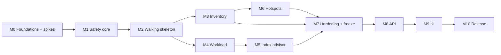

# DB Analyzer: Engineering Execution Plan

| | |
|---|---|
| **Based on** | `docs/proposal.md` (Draft v3: OpenAI API, Postgres 15+, self-managed + Azure), glossary in `CONTEXT.md`, decisions in `docs/adr/` |
| **Builder** | 1 engineer, half time (≈ 2.5 focused days / week) |
| **Order** | Agent first (usable from CLI + LangGraph Studio) → API layer → Web UI. **Re-planned 10 Oct 2026 (ADR 0015):** agent paused after M4; API and UI next, on the current agent |
| **Tracking** | GitHub Issues + GitHub Projects |
| **Test data** | Synthetic Docker databases only (no real DB yet) |
| **Start** | Mon 12 Oct 2026 |
| **Date** | 9 Oct 2026 |

---

## 1. Summary

**Re-plan, 10 Oct 2026 (ADR 0015).** Phase A stops after M4. Index health (M5-05), Run comparison and report export (M7-04) are done too. The rest of M5–M7 is paused, and its tickets carry the `paused` label. The API (M8) and UI (M9) are built next on the current agent, then the release (M10). The table below is the original plan, kept for reference. The current order is:

| Phase | Milestones | Effort (days, incl. 20% buffer) | Calendar (half time) | Outcome |
|---|---|---|---|---|
| **B. API** | M8 | ≈ 11 | 12 Oct → ~13 Nov 2026 | FastAPI service on the frozen v1 facade and event stream |
| **C. UI** | M9 | ≈ 14 | → ~22 Dec 2026 | Web UI: connections, chat with progress panel, Runs, Findings, audit and usage |
| **Release** | M10 | ≈ 7 | → ~mid Jan 2027 | Packaged v1, docs, PG 15–18 matrix, real-DB and Azure validation |
| **A. Agent (paused)** | M5–M7 remainder | ≈ 20 | after the release, if resumed | Index advice, entity map and hotspots, full analysis, evals |

Original plan:

| Phase | Milestones | Effort (days, incl. 20% buffer) | Calendar (half time) | Outcome |
|---|---|---|---|---|
| **A. Agent** | M0–M7 | ≈ 62 | 12 Oct 2026 → ~1 Apr 2027 | Full agent usable from CLI and LangGraph Studio |
| **B. API** | M8 | ≈ 8 | → ~24 Apr 2027 | FastAPI service wrapping the same agent |
| **C. UI** | M9–M10 | ≈ 19 | → ~17 Jun 2027 | Web chat UI, findings and audit panels, packaged release |
| **Total** | | **≈ 90 days** | **≈ 36 weeks** | |

Key earlier checkpoints:

- **~21 Dec 2026 (M2): walking skeleton.** Chat with the agent in the terminal about table sizes on a synthetic DB, with every guardrail in place.
- **~27 Jan 2027 (M4): agent MVP.** Inventory + slow-query analysis end to end. This is the earliest useful cut if you need to show something.
- **~1 Apr 2027 (M7): agent complete.** All five requirements, evals, reports. UI/API work starts.

Dates assume an even 2.5 days/week and no holidays. Late December and other leave will push them; re-plan at each milestone review (§7).

---

## 2. Defaults taken from the proposal

The open questions in proposal §12.2 are not settled, so this plan proceeds on these defaults. Each can change later without reworking the plan; the item noted shows where it would plug in.

| Open question | Default used in this plan | Where it lands |
|---|---|---|
| OpenAI models | Shortlist 2–3 in M0 spike, choose by eval score and cost in M7 | M0-S3, M7 |
| Data governance (sending metadata to OpenAI) | Not blocking: only synthetic DBs are used until real-DB validation. Privacy filter + `LLMGateway` still built in M1/M2 | M1, M2 |
| Budget | Usage tracked from M2; per-turn token limit enforced; monthly cap is a config value with no default amount | M2, M7 |
| Web UI | Custom FastAPI + React (proposal recommendation). LangGraph Studio covers debugging until then | M8, M9 |
| Multi-database scope | One database per Connection; `azure_sys` is an auxiliary session of the Connection, not a Connection | M1, M4 |
| Schema-per-tenant layouts | Not supported in v1; noted as a follow-up | Backlog |
| Hotspot fallback | Show the `pg_stats` estimate, clearly labelled, when exact counts are skipped | M6 |
| Secrets | `.env` / environment variables for v1; per-Connection entity-hash secret in a generated `0600` key file (not SQLite) | M1 |
| Log-file upload | Deferred; `pg_stat_statements` and Azure Query Store only | Backlog |
| Who uses it | Engineers; `hash_entity_ids` off by default for surrogate-type keys (text-typed entity keys are always hashed, ADR 0001) | M1 |

---

## 3. Architecture seams that make "agent first" work

The API and UI must be thin layers over the agent, not a rewrite. Three seams are built during Phase A and frozen before Phase B:

1. **`AnalyzerService` facade** (`db_analyzer/service.py`): the only entry point used by CLI, LangGraph Studio, API and tests.

   ```python
   class AnalyzerService:
       def add_connection(cfg) -> Connection
       def probe(connection_id) -> ProbeResult
       def start_thread(connection_id) -> Thread
       async def send(thread_id, message) -> AsyncIterator[AgentEvent]   # streaming
       async def resume(thread_id, interrupt_id, payload) -> AsyncIterator[AgentEvent]  # e.g. entity-map confirmation
       async def run(connection_id, scope) -> AsyncIterator[AgentEvent]   # deterministic Run, no LLM; agent tools call this too
       def runs(connection_id) -> list[Run]
       def findings(connection_id, status=None) -> list[Finding]          # stable across Runs
       def observations(finding_fingerprint) -> list[Observation]         # one per Run that saw it
       def set_finding_status(connection_id, fingerprint, status) -> Finding
       def audit(thread_id) -> list[AuditEntry]
       def usage(thread_id) -> Usage
       def export(run_id, fmt: Literal["md","json"]) -> bytes
   ```

2. **Typed event stream (`AgentEvent`)**: a Pydantic union (`token`, `tool_started`, `tool_finished`, `sql_executed`, `sql_rejected`, `todo_updated`, `subagent_started/finished`, `run_started/finished`, `observation`, `interrupt`, `usage`, `error`, `done`). The CLI renders these with Rich; the API later streams the same objects as SSE; the UI renders them. Defined in M2.

3. **Human-in-the-loop via LangGraph interrupts**: the entity-map confirmation (M6) is a graph interrupt answered through `resume()`. CLI prompts for it in the terminal; the UI later shows a form. No logic changes between them.

Everything is stored in SQLite from the start (checkpoints, findings, audit, usage), so the API in Phase B mostly exposes data that already exists.

---

## 4. Phase A: Agent (M0–M7)

Estimates are focused engineer-days **before** buffer. Each task maps to one GitHub issue; IDs are used in the issue titles (e.g. `[M1-04] QueryGuard: pglast allowlist`).

### M0: Foundations and spikes (6 d) · target ~1 Nov 2026

| ID | Task | Est. | Done when |
|---|---|---|---|
| M0-01 | Repo scaffold: `uv` project, `src/` layout per proposal §11, ruff, mypy, pytest, pre-commit | 0.5 | `make check` passes |
| M0-02 | GitHub Actions CI: lint, types, unit tests, integration tests against Docker PG matrix | 0.5 | CI green on PR |
| M0-03 | `docker-compose` fixtures: Postgres 15, 16, 17, 18 with `pg_stat_statements`, `hypopg`, `pgstattuple` | 0.5 | `make db-up` starts all four |
| M0-04 | Synthetic dataset generator (see §6): multi-tenant schema, skew, missing FK indexes, duplicates, bloat, slow-query workload | 1.5 | Seeded DB + workload replay script; known "ground truth" findings file |
| M0-S1 | **Spike:** PG 15 generic-plan path (`PREPARE` + `force_generic_plan` + `EXPLAIN EXECUTE`), incl. DML, in a read-only txn, on primary and standby | 1 | Notes + tests; go/no-go |
| M0-S2 | **Spike:** `pglast` parse + allowlist prototype; check DML-in-CTE, `FOR UPDATE`, multi-statement detection | 0.5 | Prototype rejects first 30 corpus cases |
| M0-S3 | **Spike:** deepagents + `ChatOpenAI` with 2 dummy tools, strict schemas, subagent, SQLite checkpointer; try 2–3 OpenAI models; record tokens/turn | 1 | Notes with model shortlist + cost per turn |
| M0-05 | Spike results recorded as ADRs in `docs/adr/` (numbered after ADR 0001) | 0.5 | ADRs for each spike |

**Exit gate:** all three spikes go, or the proposal is amended before M1 (e.g. drop PG 15 generic-plan path and EXPLAIN only on PG 16+).

### M1: Safety core and Postgres adapter base (9.5 d) · target ~1 Dec 2026

Safety comes before any LLM touches a database.

| ID | Task | Est. | Done when |
|---|---|---|---|
| M1-01 | Domain model (proposal §4.1, incl. `Run` with scope + skipped, `Finding` fingerprint rules per category and `obsolete` status, `Observation`) + config loading (`pydantic-settings`, YAML + env) | 1 | Types + tests; fingerprints stable for the same subject, incl. `slow_query` across PG 15 → 16 (text hash, not `queryid`) |
| M1-02 | `StoreAdapter` protocol, `Capability` enum, entry-point registry | 0.5 | Dummy adapter loads via entry point |
| M1-03 | Postgres connection manager (`psycopg` 3, single connection, session hardening per proposal §3.2) | 0.5 | Session settings verified in test |
| M1-04 | `QueryGuard` (pglast): statement allowlist, function allowlist, single-statement rule, **agent vs internal profiles** (proposal §3.3) | 1.75 | Corpus (below) fully rejected under both profiles; `EXPLAIN <DML>` rejected under agent profile |
| M1-05 | EXPLAIN gate: JSON plan parse, total cost / result rows / max scan rows, structured rejection reason; **explicit exemption list** by statement type (catalog-only reads, `SHOW`, `EXPLAIN`, …) decided from the parse tree | 1 | Boundary tests on seeded DB; catalog view joined to a user table is gated |
| M1-06 | `SafeExecutor`: guard → gate → read-only txn → timeouts → result | 0.5 | All SQL paths use it (lint rule bans raw cursor use outside it) |
| M1-07 | Read-only self-check at connect (write probe must fail, else abort) | 0.25 | Test with a writable role aborts |
| M1-08 | Privacy filter: template output allowlist + LLM-SQL output check (aggregates / entity keys only); **forced hashing of non-surrogate entity keys** (ADR 0001) with HMAC-SHA256 + per-Connection local secret | 1.25 | Tests reject `SELECT email …`; a text entity key never reaches the LLM in clear, even with `hash_entity_ids: false`; same ID hashes identically across Runs and differently across Connections; secret absent from SQLite |
| M1-09 | Audit log + SQLite store (SQLAlchemy + Alembic): `connections`, `audit_log`, `probes`, `runs`, `findings`, `observations` | 1 | Every executed/rejected statement logged |
| M1-10 | Postgres probe (version, primary/replica, Azure detection, extensions, privileges, settings, stats age) | 0.5 | Probe JSON on all 4 PG versions |
| M1-11 | **Safety corpus** (~200 forbidden statements) run (a) through `QueryGuard`, (b) with guard bypassed against real read-only role | 1 | Both suites in CI, 100% rejected |
| M1-12 | `docs/setup/postgres_role.sql` + Azure notes | 0.25 | Script used by fixtures |

**Exit gate:** safety suite green on PG 15–18 in CI. No later milestone may merge if it turns red.

### M2: Walking skeleton (6 d) · target ~21 Dec 2026

Thinnest end-to-end path: terminal chat → agent → one capability → database.

| ID | Task | Est. | Done when |
|---|---|---|---|
| M2-01 | LLM factory + `LLMGateway` (OpenAI only; retries, timeouts, concurrency semaphore, outgoing privacy re-check, request log) | 1 | Unit tests with recorded responses |
| M2-02 | Usage tracking (tokens + estimated cost per call/thread) + per-turn token and tool-call limits | 0.5 | Limit exceeded → clean stop event |
| M2-03 | Tool factory: generate tools from adapter capabilities, strict JSON schemas | 1 | Missing capability → tool absent |
| M2-04 | Orchestrator graph (deepagents) with `probe` + basic `get_storage_stats` tools, SQLite checkpointer | 1 | Answers "biggest tables?" on seeded DB |
| M2-05 | `AgentEvent` schema + `AnalyzerService` facade (§3) | 1 | CLI and tests use only the facade |
| M2-06 | CLI (`typer` + `rich`): `dbx connect`, `dbx chat`, `dbx analyze --report out.md`, `dbx audit` | 1 | Streaming chat with tool/SQL progress |
| M2-07 | `langgraph.json` + Studio setup docs | 0.25 | Graph opens in Studio with seeded DB |
| M2-08 | LLM record/replay harness (VCR-style cassettes) for CI | 0.25 | CI runs agent tests offline |

**Demo:** chat in the terminal about table sizes; show the audit of every SQL with its EXPLAIN cost.

### M3: Inventory analyzer (4 d) · target ~4 Jan 2027

| ID | Task | Est. | Done when |
|---|---|---|---|
| M3-01 | Catalog query library (`queries/*.sql` with header metadata) + loader + version selection | 0.5 | Templates tested on PG 15–18 |
| M3-02 | Inventory: sizes (heap/index/TOAST), estimated rows, partition rollup, schema rollup | 1 | Matches ground truth |
| M3-03 | Gated exact `count(*)` (opt-in, small tables / user request) | 0.5 | Gate skip reported correctly |
| M3-04 | Bloat (`n_dead_tup`, `pgstattuple_approx` if present), stale-stats, index-heavier-than-heap findings | 1 | Seeded bloat detected |
| M3-05 | `inventory-analyst` subagent + prompt; analysis creates a Run; Findings upserted by fingerprint, Observations + snapshots persisted | 1 | "Analyze storage" produces ranked findings; second Run re-observes the same Findings without duplicating them |

### M4: Workload and slow queries (7 d) · target ~27 Jan 2027 · **agent MVP**

| ID | Task | Est. | Done when |
|---|---|---|---|
| M4-01 | Workload source detection + `pg_stat_statements` provider (top-N by total/mean time, blocks read, temp) | 1 | Seeded slow queries ranked |
| M4-02 | Azure Query Store provider (auxiliary session to `azure_sys`, owned by the Connection, same `SafeExecutor` + audit) | 1 | Tested against fixture tables mimicking `query_store.qs_view`; live Azure check deferred until access |
| M4-03 | Generic-plan EXPLAIN: PG 16+ `GENERIC_PLAN`, PG 15 `PREPARE` path (from M0-S1), via the internal guard profile with verbatim workload text only | 1 | Plans for all seeded statements incl. DML |
| M4-04 | Plan normalizer → `PlanNode` tree | 1 | Golden-file tests |
| M4-05 | Plan rules (seq scan on large table, big nested loop, spill-prone sort/hash, unindexed FK filter, non-selective index, stale stats) | 1.5 | Each rule has a positive and negative test |
| M4-06 | `workload-analyst` subagent; "no workload source" fallback (schema-only review + how to enable) | 1 | Works with and without `pg_stat_statements` |
| M4-07 | Stats-window warning (`stats_reset` too recent) | 0.5 | Warning shown |

**Checkpoint:** agent MVP. Write a short demo script and record a run.

### M5: Index advisor (5 d) · target ~13 Feb 2027

**Paused (ADR 0015)**, except M5-05 (index health), which is done.

| ID | Task | Est. | Done when |
|---|---|---|---|
| M5-01 | Candidate generation (equality → range → sort ordering, FK columns) | 1.5 | Expected candidates for seeded queries |
| M5-02 | Dedupe against existing indexes (prefix coverage) | 0.5 | No duplicate suggestions |
| M5-03 | HypoPG validation: create, re-EXPLAIN, cost delta, size, reset | 1 | Cost deltas reported; works on standby |
| M5-04 | Fallback "unvalidated" path without HypoPG | 0.25 | Confidence labelled |
| M5-05 | Index health: unused, duplicate/overlapping, invalid | 0.75 | Seeded cases detected |
| M5-06 | `index-advisor` subagent; DDL output as `CREATE INDEX CONCURRENTLY` text only | 1 | Advice with DDL in chat/report |

### M6: Entity hotspots (7 d) · target ~8 Mar 2027

**Paused (ADR 0015).** This includes entity-key hashing (ADR 0001): no entity key reaches the LLM until the entity map exists.

| ID | Task | Est. | Done when |
|---|---|---|---|
| M6-01 | FK graph + root detection (fan-in) + name patterns + `pg_stats` skew signal | 1.5 | Correct candidates on seeded schema |
| M6-02 | Entity-map proposal via OpenAI structured output | 1 | Valid map for seeded schema across eval runs |
| M6-03 | Confirmation interrupt (`resume()`), versioned `entity_maps` table, CLI prompt to accept/edit | 1 | Confirmed map reused on next run |
| M6-04 | Gated exact rows and bytes per entity (`GROUP BY`, `pg_column_size`) | 1 | Seeded skewed tenant found; skips reported |
| M6-05 | Roll-up through hierarchy (booking → account → tenant), gated joins | 1 | Child-table bytes attributed to tenant |
| M6-06 | Partition-aware shortcut + labelled `pg_stats` fallback when gated out; gated-out tables recorded in `Run.skipped`, not scope; entity-map edits mark affected hotspot Findings `obsolete` | 0.5 | Both paths tested; a gated-out table never triggers a "fixed?" prompt |
| M6-07 | `hotspot-analyst` subagent + skew metrics + findings; targeted questions create a Run scoped to the collections asked about | 1 | "Which tenant uses most space in `events`?" answered and recorded as a scoped Run |

### M7: Agent hardening and model selection (7 d) · target ~1 Apr 2027 · **agent complete**

**Paused (ADR 0015)**, except for the following:
- M7-04 (report export and Run comparison) is done.
- M7-05 (budget cap) is paused, and the UI shows usage instead.
- The facade freeze from the exit gate moves to M8-01.
- M7-07 (docs) moves to M10-03.

| ID | Task | Est. | Done when |
|---|---|---|---|
| M7-01 | Eval suite: 20–30 scripted conversations scored on findings recall vs ground truth, number accuracy, tool-call validity, tokens, cost, latency | 2 | `make eval MODEL=…` produces a scorecard |
| M7-02 | Run evals on shortlisted OpenAI models; pick orchestrator + subagent models; record ADR | 1 | Config defaults set |
| M7-03 | Orchestrator "full analysis" plan (todos → subagents → summary with structured findings) | 1 | One command analyses whole DB |
| M7-04 | Report export (Markdown + JSON) and Run-to-Run comparison from snapshots (only over scope both Runs share); "not seen in latest Run: fixed?" prompt only when the latest Run's scope covered the Finding's subject; automatic `obsolete` when the subject is gone from the probe | 1 | `dbx analyze` report diffable across Runs; partial or targeted Runs never shown as regressions |
| M7-05 | Budget: monthly cap config, warn at 80%, stop at 100% | 0.5 | Tested with low cap |
| M7-06 | Large-schema test (500 tables generated) for token/latency limits | 0.5 | Full analysis within agreed limits |
| M7-07 | Docs: README, setup (role, extensions), CLI usage, Studio usage, config reference | 1 | New user can run on fixture DB from docs |

**Exit gate (freeze seams):** `AnalyzerService` and `AgentEvent` are versioned (`v1`) and changes after this point need an ADR, because API and UI build on them.

---

## 5. Phase B and C: API and UI (M8–M10)

Re-planned 10 Oct 2026 (ADR 0015): built on the agent as it is after M4, for one engineer running locally.

### M8: API layer (9 d) · target ~13 Nov 2026

| ID | Task | Est. | Done when |
|---|---|---|---|
| M8-01 | Shape `AnalyzerService` for HTTP (list Connections and Threads, cancel a Turn); add `subagent_started` / `subagent_finished` events; freeze facade and `AgentEvent` at v1 in an ADR (from M7's exit gate, #26) | 1.5 | CLI and tests unchanged in behaviour; ADR records v1 |
| M8-02 | FastAPI app skeleton, settings, error model, bind to `127.0.0.1` by default + optional static token | 0.5 | Health endpoint, auth test |
| M8-03 | Connections: create/update (DSN by env var name only, never stored), probe, session and gate limits, identifier aliasing | 1.5 | Endpoints + tests; a missing env var is a clear error |
| M8-04 | Threads and messages: `POST /threads/{id}/messages` streaming `AgentEvent` over SSE | 1.5 | Event stream matches CLI |
| M8-05 | Cancellation (`POST /threads/{id}/cancel`) and one active Turn per Thread | 0.5 | Cancel mid-turn cleanly; a second concurrent Turn is refused |
| M8-06 | Deterministic Runs without chat: inventory, workload, targeted tables, exact counts | 0.5 | Same Runs as `dbx analyze`, no LLM needed |
| M8-07 | Findings (filter, status update) + Observations per Finding, Runs, Run comparison, audit, usage, export endpoints | 1.5 | Endpoints + tests |
| M8-08 | OpenAPI spec + generated TypeScript client (`openapi-typescript`) | 0.5 | Client builds in `web/`; CI fails when it drifts |
| M8-09 | API integration tests using recorded LLM cassettes | 0.5 | In CI |

Cut from the original M8: the entity-map interrupt resume endpoint (returns with M6).

### M9: Web UI (11.5 d) · target ~22 Dec 2026

| ID | Task | Est. | Done when |
|---|---|---|---|
| M9-01 | Vite + React + TypeScript scaffold, routing, design tokens, generated API client | 1 | App shell renders |
| M9-02 | Connection manager: add/test connection, probe "what I can see", primary/replica banner | 1.5 | Usable end to end |
| M9-03 | Chat view: SSE streaming, markdown, inline tables, stop button | 2.5 | Parity with CLI chat |
| M9-04 | Progress panel: tools, subagents, SQL executed/rejected (with reason), Runs finished, limits reached, live | 1.5 | Live during a Turn |
| M9-05 | Analyze action: start inventory or workload Runs (targeted tables, exact counts) without chat | 1 | Run appears with its Findings |
| M9-06 | Findings board: filter by category/severity/status (obsolete hidden by default), Observation history per Finding, DDL copy, acknowledge/fixed, "fixed?" confirmations; Runs list and comparison | 2 | Persists via API |
| M9-07 | Audit panel + usage/cost display | 1 | Matches DB audit log |
| M9-08 | Safety-limit editor + report export buttons | 0.5 | Works |
| M9-09 | Component tests (Vitest) | 1 | Key components covered |

Cut from the original M9: the entity-map confirmation form (returns with M6) and orchestrator todos in the progress panel (return with M7-03).

### M10: Release (6 d) · target ~mid Jan 2027

| ID | Task | Est. | Done when |
|---|---|---|---|
| M10-01 | Playwright e2e: connect → analyze → chat "what's slow?" → findings → export | 1.5 | Green in CI with cassettes |
| M10-02 | Packaging: Docker image (API serves built UI) + compose file; `pipx`-installable CLI | 1 | One-command start |
| M10-03 | Docs: install, security model, data sent to OpenAI, config reference, troubleshooting; a fresh checkout reaches a report from the docs alone (the docs half of #26) | 1 | Docs reviewed |
| M10-04 | v1.0 release checklist and tag | 0.5 | Release published |
| M10-05 | Real-DB validation run on a staging/replica DB and one Azure Flexible Server, including the live Query Store check deferred by #17 (needs data-governance approval) | 0.5 | Findings reviewed; gaps filed as issues |
| M10-06 | Restore the PG 14–18 integration test matrix in fixtures and CI (#27) | 1 | CI green on the full matrix |

---

## 6. Testing plan, since only synthetic data is available

The synthetic dataset (M0-04) has to stand in for a real database, so it is built to exercise every finding type with a **ground-truth file** the eval suite checks against:

| Scenario seeded | Expected finding |
|---|---|
| `tenants → accounts → bookings → booking_items`, `events`, `audit_log` (≈ 5–10 GB total at full scale, small scale for CI) | Inventory ranking |
| One tenant owning ~35% of `events` rows and ~50% of bytes (large JSONB payloads) | Hotspot rows vs bytes differ |
| `booking_items` referencing only `booking_id` | Roll-up attributes it to tenant |
| FK columns without indexes on 3 tables | Missing-index + FK findings |
| Duplicate and never-used indexes | Index health |
| Table with heavy updates and autovacuum disabled | Bloat / dead tuples |
| Workload replay (`pgbench` custom scripts): seq-scan filters, big sorts, slow `UPDATE`s | Slow-query ranking + plan rules |
| Table with `last_analyze` far in the past | Stale-stats warning |
| One table partitioned by `tenant_id` | Partition-aware hotspot path |
| 500-table generated schema | Scale/token limits |

**Gap this leaves:** no real-world schema naming, real workload mix or real Azure Query Store data. Mitigation: before calling v1 done, one validation run against a real staging/replica database (and one Azure Flexible Server) is listed as an exit item in M10; it needs the data-governance decision first.

Test layers and when they run:

| Layer | Runs | Blocks merge? |
|---|---|---|
| Unit + safety corpus (guard only) | every push | yes |
| Integration (PG 15–18 Docker, safety corpus at DB layer, analyzers vs ground truth) | every PR | yes |
| Agent tests with recorded LLM cassettes | every PR | yes |
| Live evals against OpenAI | manual / weekly, and before changing models | no (scorecard reviewed) |
| UI e2e (Playwright) | from M10, every PR | yes |

---

## 7. GitHub setup

**Milestones:** `M0 Foundations` … `M10 Release` with the target dates above.

**Labels:**

| Group | Labels |
|---|---|
| Area | `area/safety`, `area/adapter-pg`, `area/analyzer`, `area/agent`, `area/llm`, `area/cli`, `area/api`, `area/ui`, `area/infra`, `area/docs` |
| Type | `type/feature`, `type/spike`, `type/test`, `type/bug`, `type/chore` |
| Priority | `p0` (safety, blockers), `p1`, `p2` |
| Size | `size/S` (≤ 0.5 d), `size/M` (≤ 1 d), `size/L` (≤ 2 d) |

**Project board** (GitHub Projects, table + board views): columns `Backlog → Ready → In progress → In review → Done`; custom fields `Estimate (days)`, `Milestone`, `Phase (Agent/API/UI)`. A "Burn-up by milestone" chart tracks estimate done vs planned.

**Issue template** (`.github/ISSUE_TEMPLATE/task.md`): Context · Scope · Acceptance criteria · Test plan · Safety impact (yes/no; if yes, safety suite must be extended).

**PR rules:** CI green, safety suite green, any change to `safety/` or `adapters/*/guard*` adds corpus cases.

**Cadence (solo):**

- Weekly: 30-min self-review of the board, add ADRs for decisions taken, move dates if needed.
- End of each milestone: short demo recording + milestone review (scope cut or re-estimate the rest).

---

## 8. Critical path and risks to the schedule



Since the re-plan (ADR 0015), M8 follows M4 directly. M5–M7 are paused, and their remaining work comes after M10 if it is resumed.

Solo work means milestones run in sequence even where the graph allows parallel work; M3 and M4 could swap if slow-query analysis is the more urgent demo.

| Risk | Impact | Response |
|---|---|---|
| M0-S1 fails (PG 15 generic plans unreliable) | Slow-query plans on PG 15 | EXPLAIN only on PG 16+; on PG 15 report stats without plans |
| OpenAI tool-calling quality weaker than expected on deep plans | M2/M7 slip | Push more logic into deterministic analyzers; fewer, coarser tools; stronger model for orchestrator only |
| Half-time capacity drops (holidays, other work) | All dates move | Dates are re-baselined at every milestone review; cut list below |
| Synthetic data misses real-world patterns | Surprises at first real run | Real-DB validation run as a v1 exit item |
| Scope creep from UI ideas | Phase C slips | UI scope fixed to M9 table; anything else goes to backlog |

**Cut list if time is short** (in order; since the re-plan, the first four are done or paused): Azure Query Store provider (M4-02) → index health (M5-05) → hierarchy roll-up (M6-05) → run-to-run comparison (M7-04) → safety-limit editor in UI (M9-08). Cutting all five saves ≈ 4.5 days incl. buffer (≈ 2 weeks half time).

---

## 9. Definition of done (every task)

- Code merged with tests; CI green including safety suite.
- Every new SQL path goes through `SafeExecutor` (enforced by lint rule and review).
- New findings have a seeded scenario + ground-truth entry.
- Docs/config reference updated if behaviour or settings changed.
- ADR added in `docs/adr/` for any hard-to-reverse change to the proposal; `CONTEXT.md` updated when a domain term is added or changes meaning.
